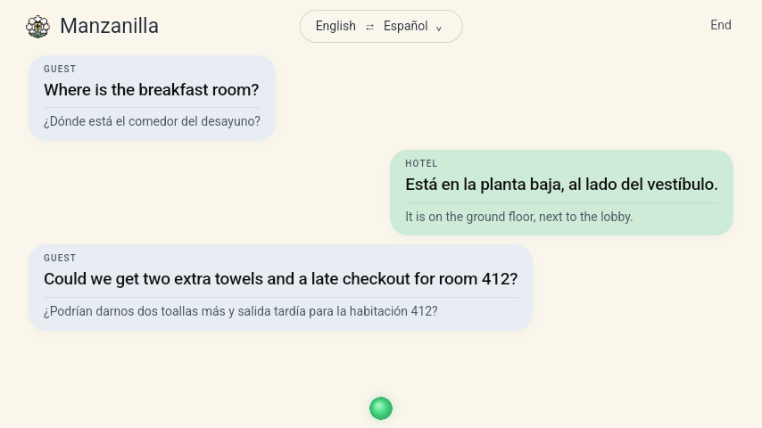
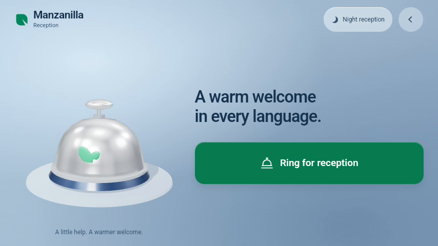

# Manzanilla

**Faster execution hardware for the hospitality industry.**

Manzanilla Reception is a landscape Android app with a reception bell and a hands-free live-translation screen. Choose the guest and hotel languages from the top language pill. Add your Gemini API key in Settings; it is encrypted on the device and is not included in the APK.

<p align="center">
  
</p>

<p align="center">
  <a href="https://github.com/somdipto/manzanilla/releases/latest/download/Manzanilla-Reception.apk"></a>
  &nbsp;
  <a href="https://github.com/somdipto/manzanilla/releases"></a>
</p>

## Install

1. On the Android device, open this link and download the APK: **[Manzanilla-Reception.apk (latest)](https://github.com/somdipto/manzanilla/releases/latest/download/Manzanilla-Reception.apk)**
2. Open the downloaded file. If Android asks, allow "Install unknown apps" for the browser or file manager you used, then tap Install.
3. Open **Manzanilla**. It starts straight on reception, without staff enrollment. Add your Gemini API key in Settings before trying translation.

<p align="center"></p>

All releases: https://github.com/somdipto/manzanilla/releases

## Updates install themselves

Every push to `main` builds a new signed release automatically. The app checks for a newer release when it opens (at most every six hours), downloads it, and asks Android to install it.

<p align="center">
  
</p>

Android shows one "Update" confirmation for apps that were installed from a file. A device set up as device owner (kiosk) installs updates with no tap at all.

## Screens

Every reception screen, original and current, is listed in [docs/screens](docs/screens/README.md).

## What is in this repository

| Folder | What it is |
| --- | --- |
| `android/hotel` | The Manzanilla Reception app (landscape, microphone, auto-update) |
| `android/app` | Earlier general-purpose controller app, kept for reference |
| `cloud` | Backend for hotel setup, device sessions and voice calls |
| `admin` | Small web dashboard for hotel setup |
| `edge`, `infra`, `shared` | Supporting services and shared definitions |
| `docs` | Architecture, pilot deployment notes, test plan |
| `.github/workflows` | CI: build, test and publish releases |

The original hand-off notes are kept in [docs/HANDOFF-README.md](docs/HANDOFF-README.md).

## Status

Beta (10.0.1): design U, Hotel assistance and Night reception were built, installed and checked on an Android emulator, see the [screen recording](docs/videos/10.0.1-emulator-walkthrough.mp4). Live translation needs your own Gemini API key in Settings. The conversation shown in the translation screenshot comes from a debug-only scripted replay that is not in release builds. Real-key speech, microphone, speaker, echo and reconnect behavior are not yet verified. Hotel assistance is not connected yet.

## Build it yourself

Requires JDK 17 and the Android SDK.

```sh
cd android
./gradlew :hotel:assembleDebug
```

Signed release builds are produced by GitHub Actions; the signing key is stored as a repository secret and is never committed.

## License

See [LICENSE](LICENSE).
