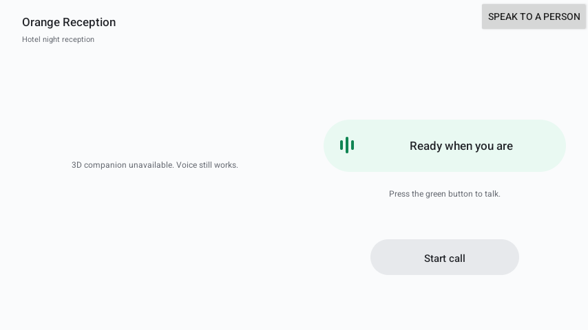
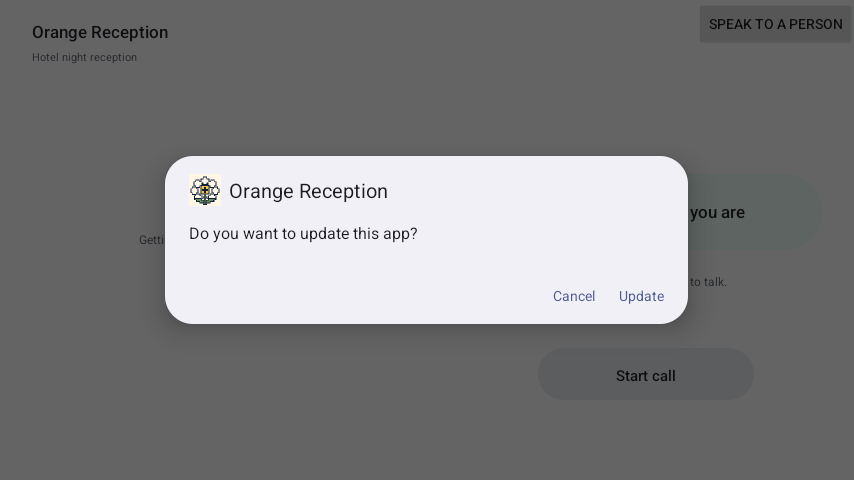

# Manzanilla

**Faster execution hardware for the hospitality industry.**

Manzanilla Orange Reception is the front-desk screen of the Manzanilla system: a landscape Android app that gives a hotel's night reception a calm, always-ready voice assistant and a one-tap way to reach a person. It runs on the Android device at the desk and stays out of the way: the assistant helps with routine requests, and "Speak to a person" is always one tap away.

<p align="center">
  
</p>

## Install

1. On the Android device, open this link and download the APK: **[Manzanilla-Reception.apk (latest)](https://github.com/somdipto/manzanilla/releases/latest/download/Manzanilla-Reception.apk)**
2. Open the downloaded file. If Android asks, allow "Install unknown apps" for the browser or file manager you used, then tap Install.
3. Open **Orange Reception**. It starts straight on the reception screen: no login, no setup.

All releases: https://github.com/somdipto/manzanilla/releases

## Updates install themselves

Every push to `main` builds a new signed release automatically. The app checks for a newer release each time it opens, downloads it, and asks Android to install it. You do not reinstall by hand.

<p align="center">
  
</p>

Android shows one "Update" confirmation for apps that were installed from a file. A device set up as device owner (kiosk) installs updates with no tap at all.

## What is in this repository

| Folder | What it is |
| --- | --- |
| `android/hotel` | The Orange Reception app (landscape, microphone, auto-update) |
| `android/app` | Earlier general-purpose controller app, kept for reference |
| `cloud` | Backend for hotel setup, device sessions and voice calls |
| `admin` | Small web dashboard for hotel setup |
| `edge`, `infra`, `shared` | Supporting services and shared definitions |
| `docs` | Architecture, pilot deployment notes, test plan |
| `.github/workflows` | CI: build, test and publish releases |

The original hand-off notes are kept in [docs/HANDOFF-README.md](docs/HANDOFF-README.md).

## Status

The reception screen, installation and automatic updates work today. Voice calls need the backend in `cloud` to be running and connected; until then the app runs in a local demo mode that shows the screen and the call states without a server.

## Build it yourself

Requires JDK 17 and the Android SDK.

```sh
cd android
./gradlew :hotel:assembleDebug
```

Signed release builds are produced by GitHub Actions; the signing key is stored as a repository secret and is never committed.

## License

See [LICENSE](LICENSE).
